# Identificación:

Alumno: Emilio Martin\
Ciclo: SMR2-AplicacionesWeb\
Centro Educativo: CES Afuera

# Objeto

Manual de instalación y configuracion de Joomla en Xampp para Windows 10.

### HW

- CPU: Intel(R) Core(TM) i5-3470 CPU @ 3.20GHz
- RAM: 16 GB RAM
- ALMACENAMIENTO: 447 GB

### SW

- Windows 10 Pro
- Xammp (**INSTALACION LIMPIA**)
- Joomla (Instalación aqui)

# Inicio de manual

## Instalacion y configuración de Joomla
Deberemos de irnosa la pagina oficial de Joomla y descargarnos la ultima version, se nos descargara en formato ZIP, en nuestro caso ya que Joomla va a ser nuestra unica pagina en todo el servicio de Xampp **extraeremos** los archivos del zip en la carpeta **C:\xampp\htdocs**

Una vez extraido, deberemos de ingresar en algun buscador la direccion IP de tu Windows, o tambien la url "**localhost**" y veremos la siguiente pagina web:
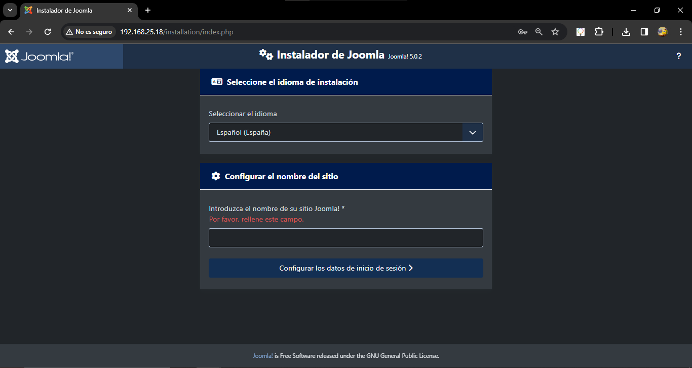

El idioma nos lo detecta solo si lo tenenemos por defecto en el buscador, ingresaremos un nombre y le daremos a "**Configurar los datos de inicio de sesión**"

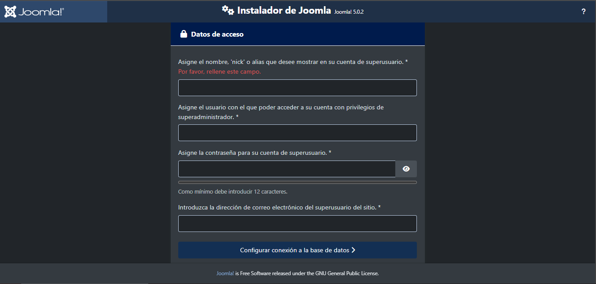

Aqui nos pedira los datos de acceso del usuario administrador, rellenaremos los datos y le daremos al boton "**Configurar conexión a la base de datos**"

## Las database 😈
El rompecabezas de las bases de datos, lo vamos a hacer facil, tendras que poner esta direccion en la url del buscador "**http://localhost/phpmyadmin/**"\
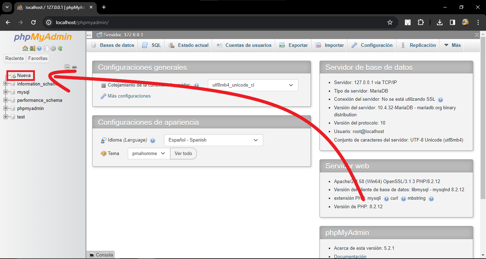\
Le tendremos que dar al boton de nueva base de datos situado arriba a la izquierda.\
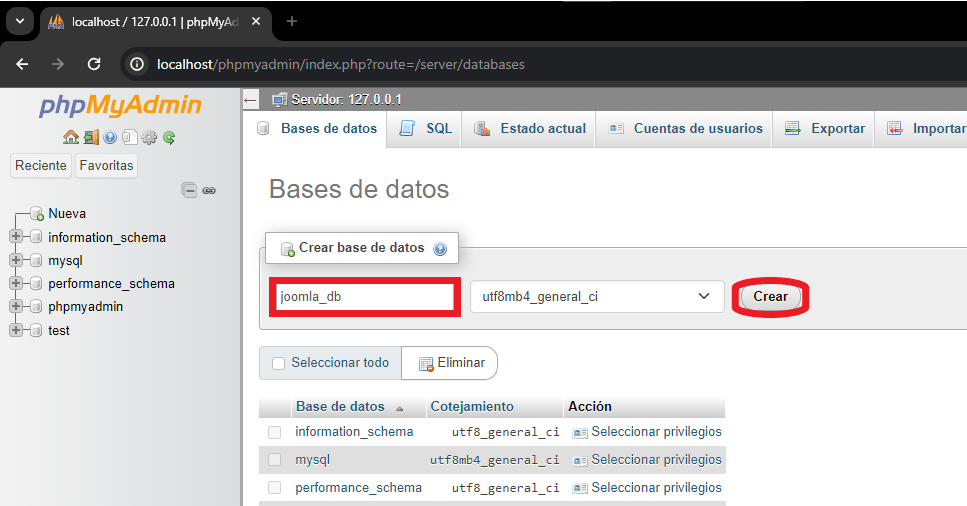\
Deberemos de ingresar el nombre "**joomla_db**" y le daremos a "**Crear**" y ya se nos creara la base de datos.\
**Facil.**

## Vuelta a la instalacion de Joomla
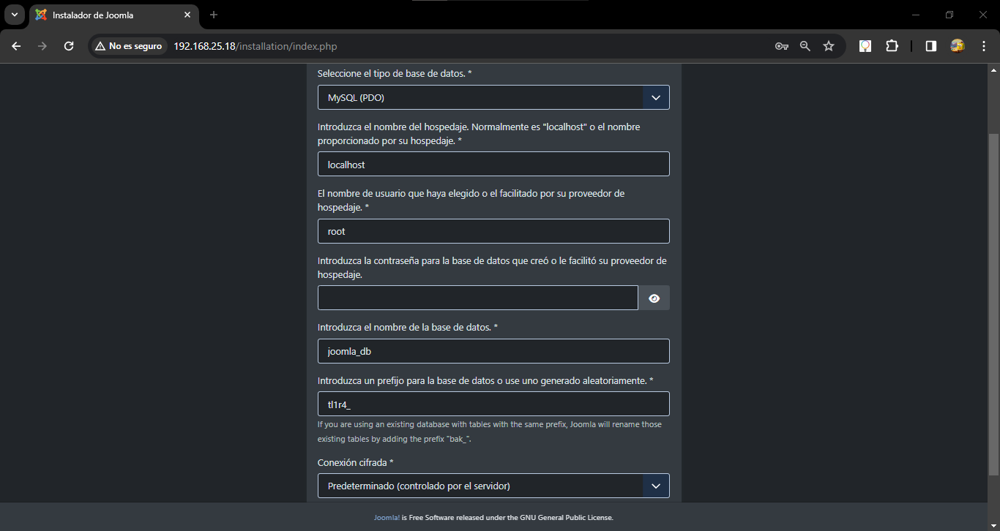\
***HAY UN ERROR CON LA CAPUTRA, NO ES TIPO DE BASE MySQL (PDO)**\
Como puedes ver en la imagen solo deberas de agregar el usuario root ya que es el usuario por defecto que nos proporciona el Xampp y le daremos al boton "**Instalar Joomla**"\
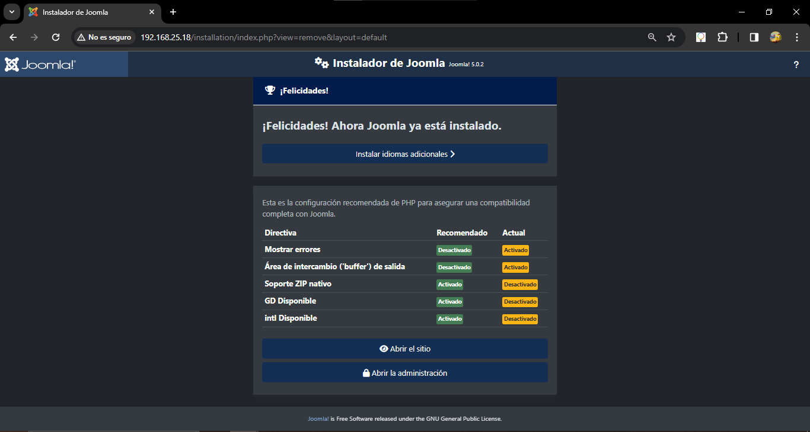\
Ya tenemos Joomla instalado correctamente, en nuestro caso como queremos administrar el sitio le daremos al boton "**Abrir la administración**"\
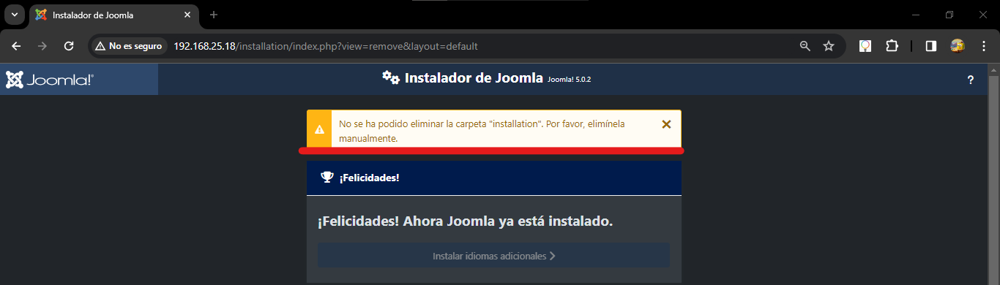\
Este es un error posible que te puede dar, para solucionarlo solo deberas de de ir a la carpeta donde se encuentra Joomla y eliminar la carpeta "**installation**" que se encuentra en "**C:\xampp\htdocs**" y la eliminaremos, una vez eliminada podremos darle de nuevo al boton "**Abrir la administración**" y si no eres un macaco, todo funcionara y mostrara esta pantalla:\
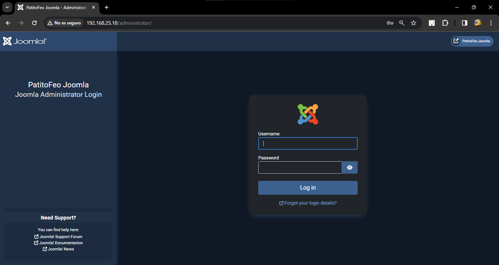
### Recuerda tu contraseña
Si incias correctamente con el usuario y contraseña podras ver el panel administrativo.\
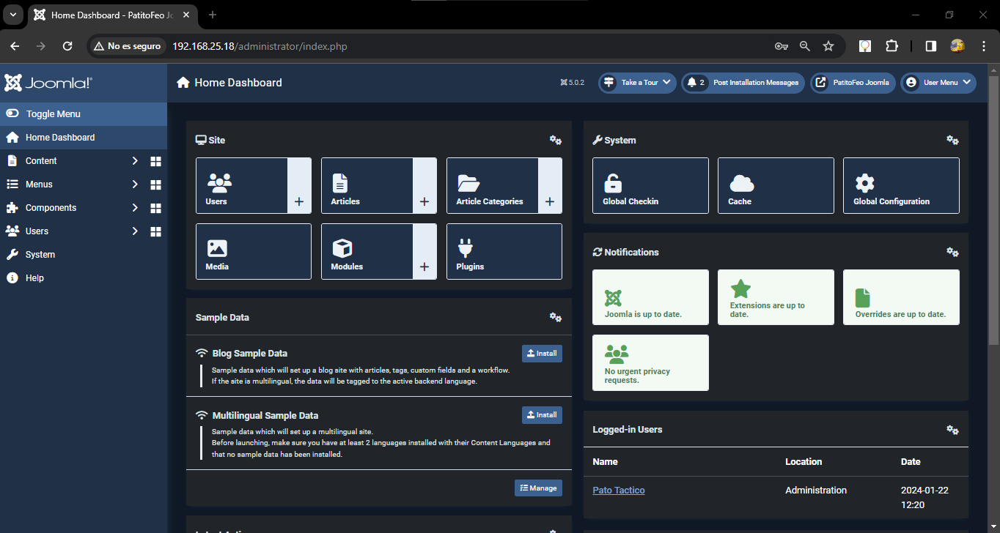
## Para gente no bilingual
Ahora vamos a cambiar el idio que viene por defecto a Español de España para ello nos iremos al apartado de "**System**" que esta en el menu de la izquierda.\
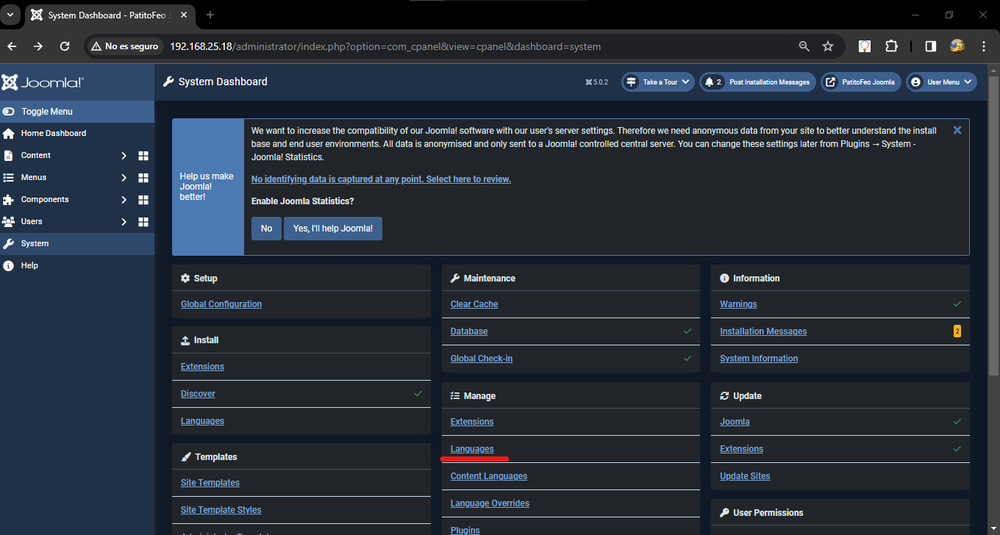
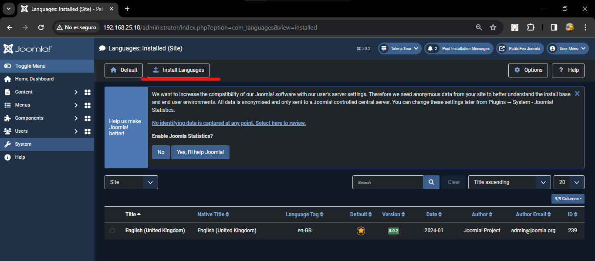
Le daremos al boton "**Install Languages**"
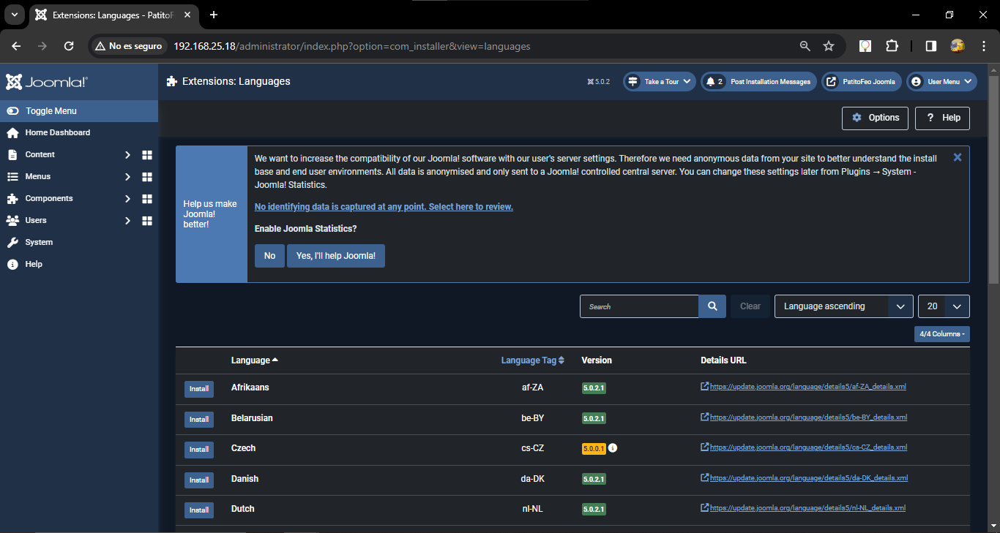
Buscaremos en el cuadro de texto la palabra "**Spanish**"
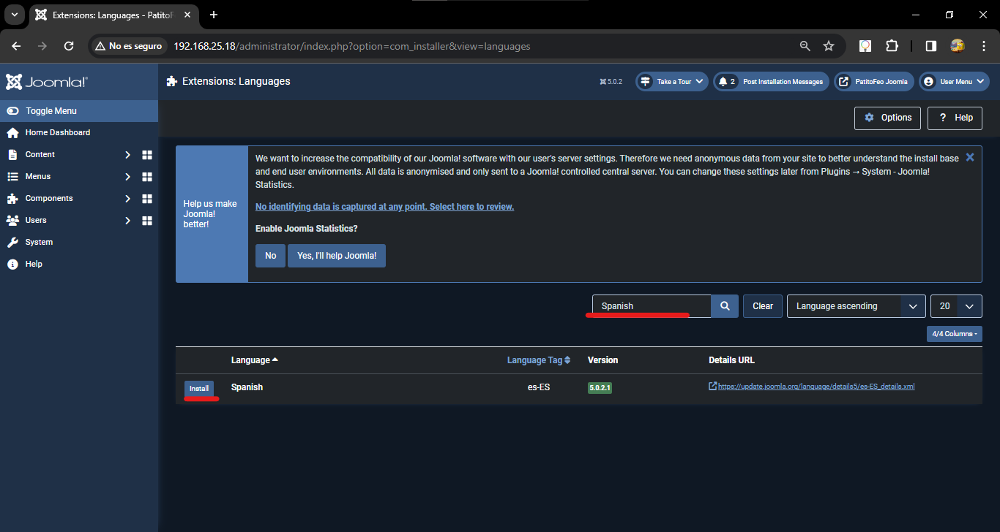
Y le daremos al boton "**Install**"
No deberemos de volver a ir al apartado de "**System**" y al apartado de "**Language**" 
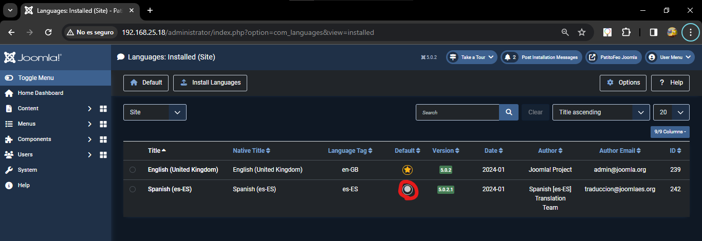
Le deberemos de dar a Default en el español y recargaremos la pagina, y ya estaria en español.
